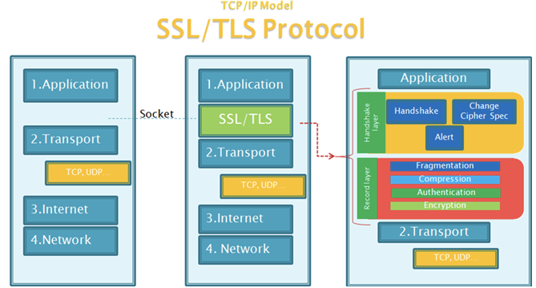
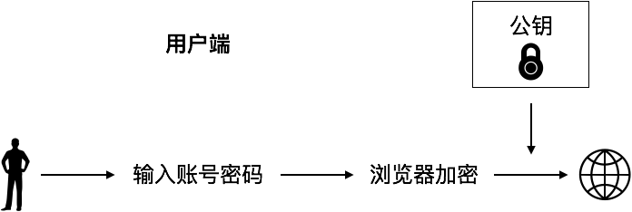
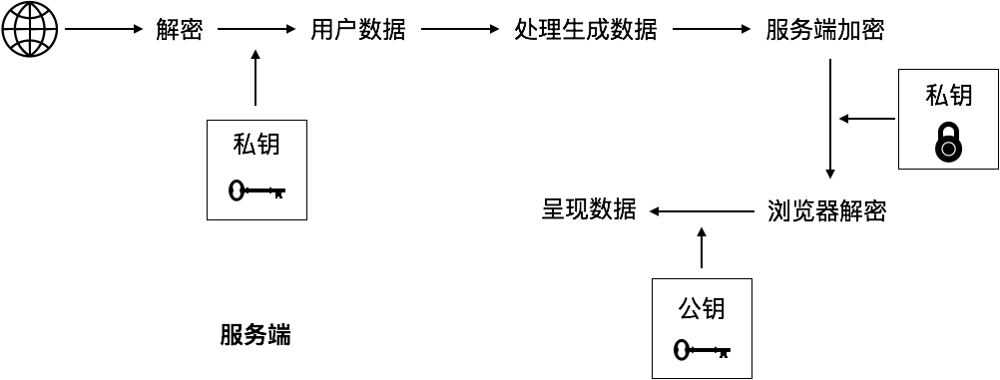
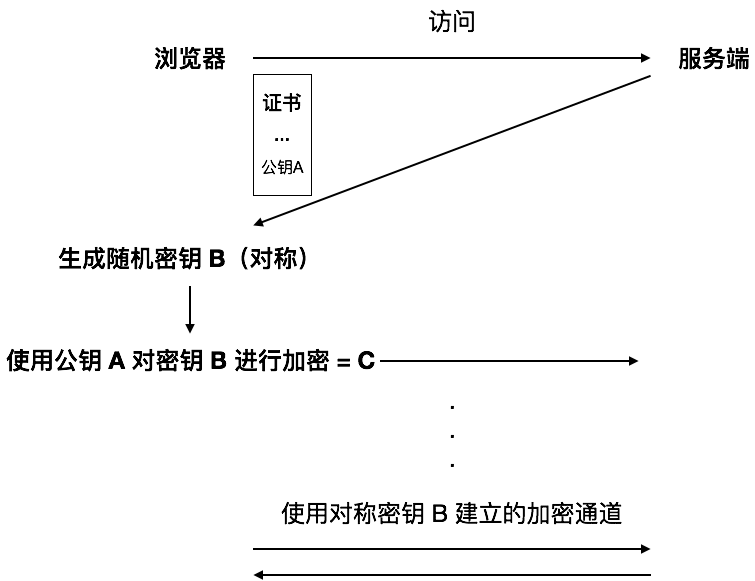

# HTTPS 工作大致流程

## HTTS 与 HTTP 的不同

## 客户端对服务端进行请求

## 服务端对客户端的相应

## 非对称加密套壳对称加密

- 由于通过服务端的私钥加密的数据，可以用公开的公钥进行解密，所以，用户数据还是不安全的
- 在非对称加密的基础上，将用户数据进行对称加密

协助理解的一些点：

- 建立 HTTPS 通信是需要客户端与服务端共同协商的
- 由于 HTTPS 是需要建立的，因此，没建立成功之前就没有什么加密通信了，都是明文传输，如证书的传输，密钥的协商
- HTTPS 真正加密的重头戏，是在 HTTPS 建立之后，使用对称密钥建立起来的通道
- 密钥协商过程明文传输，但是证书的内容保证了保证了密钥伪造，冒用手段失效

## References

- [HTTPS科普扫盲帖](https://www.chyingp.com/what-is-https/)

