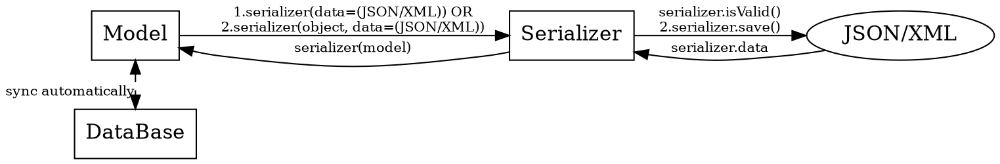

# graphviz

[👉官网地址](http://www.graphviz.org)

## 安装

```shell
brew install graphviz
```

## 例子

以下例子的流程图中，叙述了 Python 的 Django Rest Framework 中数据库, Model, Serializer, 格式为 JSON/XML 的数据之间的关系

效果图


代码：



### 记要

1. 实体，连线之间的属性设置，真的没有什么捷径，参照 [👉官方文档](http://www.graphviz.org/content/attrs) 逐个对照着找吧
2. 一些已知的属性区别
	- label, xlabel
		- label 位于连线的旁边（即连线的上面或下面）
		- xlabel 位于连线的中间，即文字的横中轴线大概与连线重合的那种
3. 实体的形状通过 shape 设置，边缘的样式通过 style 设置
4. 连线的样式通过 style 设置
5. constraint=false 可以设置忽略默认设置的层级关系
6. 通过 resolution 可以设置输出图片的分辨率和大小


## 生成图片

生成 png 图片

```shell
dot -T png -O chartDemo.dot
```

