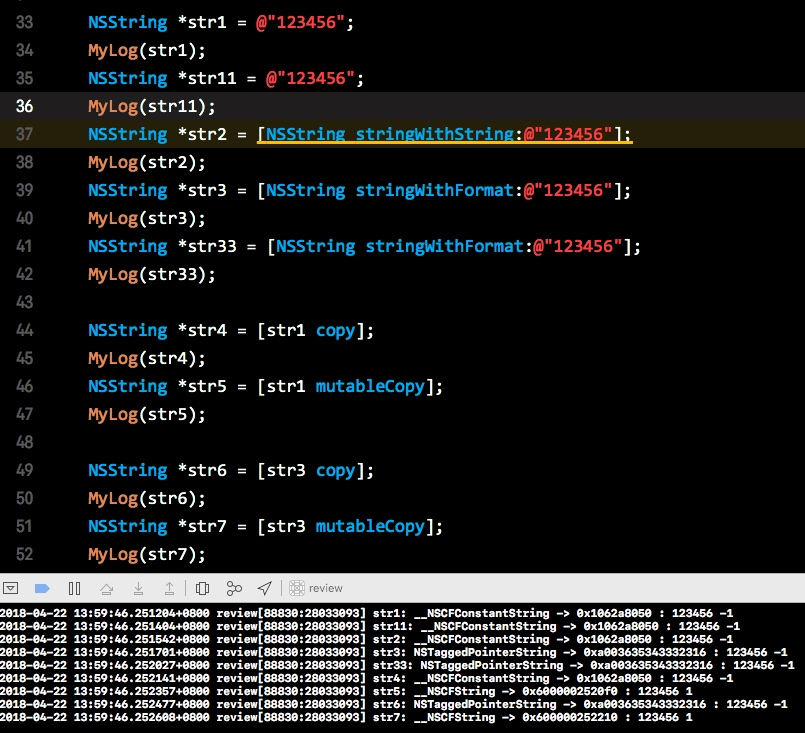
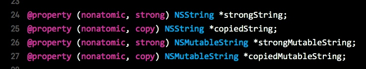
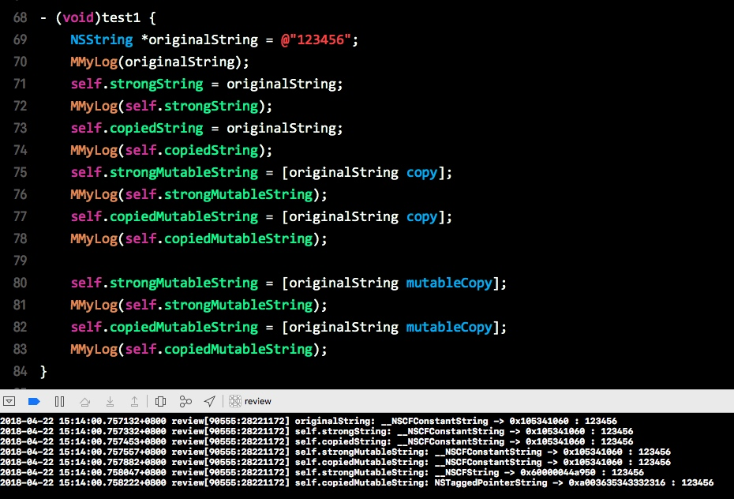
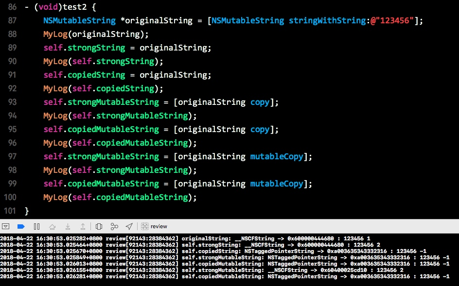

# NSString 内存管理

创建 NSString 的方法

```objc
// a
NSString *str1 = @"xxx";

// b
NSString *str2 = [NSString stringWithString: @"xxx"];

// c
NSString *str3 = [NSString stringWithFormat: @"xxx"];
```

a 方法与 b 方法没有区别，而且，在 Xcode 中，b 方法会被警告


a 方法与 b 方法生成的字符串，实质上是一个 `__NSCFConstantString`, 并且，它们的内存地址都是一样 `0x1062a8050`, 并且，由于它们的内存地址一样，a, b 方法的字符串对象，可以直接通过 `==` 来进行比较，得出相等的结果

c 方法生成的字符串，实质上是一个 `NSTaggedPointerString`, 而它的地址与 a,b 不同，为 `0xa003635343332316`

我们将会看到，最后的数字是对象的引用计数，这里为 -1 的原因是，这个 `-1` 其实是一个无符号类型的数据作为了有符号类型表示，实质上，它的数目为 `4294967295`, 表示这个对象在程序运行期间并不释放



上述定义的 `MyLog`

```objc
#define MyLog(_var) ({ \
    NSString *name = @#_var; \
    NSLog(@"%@: %@ -> %p : %@ %d", name, [_var class], _var, _var, (int)[_var retainCount]); \
})
```

先观察 str1 到 str33, 对于 str2, 由于与 str1 的创建方法没有区别，就不说明了

👉 对于 str1 和 str11, 可以看出，内存地址都为 `0x1062a8050`, 因此可以猜测，使用字面量创建的字符串，系统是进行了复用，而对象实际的类型 `__NSCFConstantString`, 引用计数为 `-1`, 也似乎说明了这一点

👉 对于 str3 和 str33, 可以看出，内存地址都为 `0xa003635343332316`, 对象的实际类型为 `NSTaggedPointerString`, 而引用计数也为 `-1`, 似乎也说明了系统对于非字面量创建的字符串，也实现了复用，但是与字面量创建的复用不同，因为对象的内存地址不一样，说明复用的并不是同一个对象

> 测试的环境为
> iOS 11.3
> Xcode 9.3

再来观察字符串的复制行为，str4, str5 是对 str1 进行复制操作，str6, str7 是对 str3 的复制操作

👉 对于 str4, 使用的是浅复制 `copy`, 可以看出，str4 与 str1 一样

👉 对于 str5, 使用的是深复制（内容复制）`mutableCopy`, 可以看出，str5 的内存地址与 str1, str4 不同，变为了 `0x6000002520f0`，类型为 `__NSCFString`, 引用计数也变为 `1`

👉 对于 str6, 使用的是浅复制 `copy`, 可以看出，str6 与 str3 一样

👉 对于 str7, 使用的是深复制（内容复制）`mutableCopy`, 可以看出，str7 的内存地址与 str3, str6 不同，变为了 `0x600000252210`, 类型也变为了 `__NSCFString`, 引用计数也变为了 1

---

对于上述的观察（可能并不全面），总结一下：

1. 无论是字面量创建，还是模版创建，系统都会对字符串进行复用
2. 虽然系统对字符串进行复用，但通过字面量创建和通过模版创建的字符串，它们复用的字符串并不相同（从内存地址角度）
3. 对于字符串的浅复制 `copy`, 只是简单地进行指针的复制，由于字符串的复用机制，引用计数是否该发生改变，已经不重要了
4. 对于字符串的深复制 `mutableCopy`, 会创建一个单独的字符串对象（开辟新的内存空间），同时，该对象的引用计数设置为 1, 说明了这个字符串对象在程序运行期间是会被释放的，而不会被复用

## 属性中的 NSString 行为



`strongString` `NSString` 类型，使用 `strong` 进行修饰

`copiedString` `NSString` 类型，使用 `copy` 进行修饰

`strongMutableString` `NSMutableString` 类型，使用 `strong` 进行修饰

`copiedMutableString` `NSMutableString` 类型，使用 `copy` 进行修饰

`MMyLog` 定义

```objc
#define MMyLog(_var) ({\
NSString *name = @#_var;\
NSLog(@"%@: %@ -> %p : %@", name, [_var class], _var, _var);\
})
```

### 测试 1



在这个测试中，`originalString` 是 `NSString` 类型

👉 对于 `NSString` 类型的 `strongString` 与 `copiedString`, 即使它们的内存管理修饰符分别是 `strong`, `copy`, 但直接通过 `=` 号赋值时，它们的行为都一样，只是简单的指针复制

👉 对于 `NSMutableString` 类型的 `strongMutableString` 和 `copiedMutableString`, 即使它们的内存管理修饰符分别是 `strong`, `copy`, 虽然调用的是 `copy` 方法，但它们的行为还是一样，指向的对象还是一样，只是进行了简单的指针复制

👉 对于 `NSMutableString` 类型的 `strongMutableString` 和 `copiedMutableString`, 它们的内存管理修饰符分别是 `strong`, `copy`, 当调用的是 `mutableCopy` 方法时，它们的行为与之前的不一样了，`strongMutableString` 与 `copiedMutableString` 之间的内存地址不一样，也与 `originalString` 的内存地址不同，发生了深复制（内容复制）

### 测试 2




在这个测试中，`originalString` 是 `NSMutableString` 类型

👉 对于 `NSString` 类型的 `strongString` 和 `copiedString`, 它们的内存管理修饰符分别是 `strong`, `copy`, 当直接调用 `=` 进行赋值时，`strongString` 与 `originalString` 内存地址一样(`0x600000444680`)，而 `copiedString` 指向了另一个字符串对象(`0xa003635343332316`)

👉 对于 `NSMutableString` 类型的 `strongMutableString` 和 `copiedMutableString`, 调用 `copy` 方法时，它们都指向了另一个字符串对象(`0xa003635343332316`)

👉 对于 `NSMutableString` 类型的 `strongMutableString` 和 `copiedMutableString`, 调用 `mutableCopy` 方法时，`strongMutableString` 指向了一个新的 `NSString` 对象，`copiedMutableString` 也指向了另一个 `NSString` 对象，但它使用复用机制

---

根据上述测试结果，总结一下

1. 当源字符串对象为 `NSString`, 目标对象为 `NSString`, 直接 `=` 赋值时，`strong` 和 `copy` 都只会发生简单的指针复制
2. 当源字符串对象为 `NSString`, 目标对象为 `NSMutableString`, 调用 `copy` 方法时，`strong` 和 `copy` 都只会发生简单的指针复制，`NSMutableString` 兼容 `NSString`
3. 当源字符串对象为 `NSString`, 目标对象为 `NSMutableString`, 调用 `mutableCopy` 方法时，`strong` 会创建一个新对象；`copy` 也会返回一个新对象，同时，这个对象很有可能是一个被复用的对象，根据测试 1 与测试 2 中内存地址的比较，`0xa003635343332316` 这个地址极有可能是一个数据共享的地方
4. 当源字符串对象为 `NSMutableString`, 目标对象为 `NSString` 时，直接 `=` 赋值时，`strong` 发生了简单的指针复制，而 `copy` 则指向另一个字符串对象（被复用）
5. 当源字符串对象为 `NSMutableString`, 目标对象为 `NSMutableString` 时，调用 `copy` 方法时，`strong` 和 `copy` 都指向了另一个字符串对象（被复用）
6. 当源字符串对象为 `NSMutableString`，目标对象为 `NSMutableString` 时，调用 `mutableCopy` 方法时，`strong` 指向了一个新的字符串对象，`copy` 指向了另一个字符串对象（被复用）

再总结：

1. [`NSString` -> (`NSMutableString` + `strong`)] + `mutableCopy` => 创建新对象
2. [`NSString` -> (`NSMutableString` + `copy`)] + `mutableCopy` => 复用对象 
3. [`NSMutableString` -> (`NSString` + `copy`)] + `=` => 复用对象
4. [`NSMutableString` -> (`NSMutableString`)] + `copy` => 复用对象
5. [`NSMutableString` -> (`NSMutableString` + `strong`)] + `mutableCopy` => 创建新对象
6. [`NSMutableString` -> (`NSMutableString` + `copy`)] + `mutableCopy` => 复用对象

实际上，当 `NSMutableString` 使用 `copy` 修饰后，`NSMutableString` 就会变成了 `NSString`

---

小发现

`__NSCFString` 内部类，用于创建预先定义好的（写代码时）字符串可变常量

`__NSCFContantString` 内部类，用于创建预先定义好的（写代码时）字符串不可变常量

`NSTaggedPointerString` 内部类，运行时创建的字符串，Apple 引入了这个技术，用于优化内存占用和运行速度

