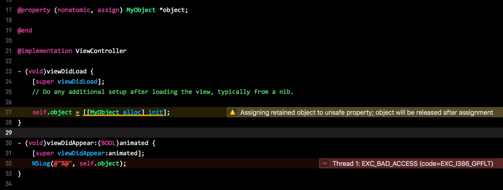

# @property 修饰符

## 读写性
- `readwrite`
- `readonly`

## setter 相关
- `assign`
- `retain`
- `copy`

### assign

直接复制，用于基本数据类型(NSInteger/CGFloat), C数据类型(int, float, double, char), 还有 `id` 类型

不涉及内存管理，当 `assign` 修饰对象类型是，会导致内存泄漏或 `EXC_BAD_ACCESS` 错误



当对 `assign` 修饰的对象进行复制时，编译器也会发生警告

### retain

针对对象类型进行内存管理，对基本数据类型使用会报错


同时，ARC 下已经不需要使用 `retain`

### copy

主要用于 `NSString` 类型，用于复制内容

## 原子性修饰符
- `atomic`
- `nonatomic`

线程保护技术，保护变量读取安全，但缺点是浪费系统资源，因此在运行 iOS 的小型设备上，一般使用 `nonatomic`

而对于需要多线程安全的场景，一般使用 `nonatomic` 修饰符，并在执行代码中，使用 `NSLock` 等手动加锁的方法来保证安全

但使用 `atomic` 之后，所修饰的数据就一定线程安全吗？

> 不是
> 
> 线程安全的安全，实际上是指在多线程的情况下，访问同一个数据（内存位置），获得的结果符合预期
> 
> 而 `atomic` 只能保证属性的 `getter` 或 `setter` 中线程安全，并不是 `getter` 与 `setter` 都线程安全
> 这意味着，当有 A, B 两个线程同时去访问属性 c. A 对 c 进行了写入操作，而后在对 c 进行读取操作，B 也对 c 进行了写操作。而我们预期的结果是：A 对 c 读取的结果应该是 A 对 c 写入的值
> 
> 而此时我们只使用了 `atomic` 来修饰，那么，A 对 c 的写操作是安全的(写入 1)，但之后 B 立刻也对 c 进行了写操作（写入 2），实际上这个写操作也是线程安全的。最后 A 才对 c 进行读取，读取到了 2, 而不是我们希望的 1, 此时，就说线程不安全了
> 而要保证 A 对 c 的写入和读取操作统一，就需要利用额外的锁机制来保证，如 `NSLock`

- [iOS多线程到底不安全在哪里？](http://mrpeak.cn/blog/ios-thread-safety/)

## getter, setter 修饰符

用于设置自定义 property 的 getter, setter 方法

## 默认的属性修饰符

基本数据类型 `atomic` + `readwrite` + `assign`

Objective-C 对象 `atomic` + `readwrite` + `strong`

# @Property 的本质

> @property = ivar + getter + setter

```objc
@interface AnObject: NSObject
@property NSString *name;
@end
```

等价于

```objc
@interface AnObject: NSObject
- (NSString *)name;
- (void)setName:(NSString *)name;
@end

@implementation AnObejct
@synthesize name = _name; // _name 为中间变量

- (NSString *)name {
    // ...
}

- (void)setName:(NSString *)name {
    // ...
}
@end
```

在 Runtime 中，propery 的定义是

```objc
typedef struct objc_property *objc_property_t;
```

而 `objc_property` 的定义又是

```objc
struct property_t {
    const char *name;
    const char *attributes;
};
```

而 `attributes` 虽然看起来是 `char *`, 但是它的结构又是

```objc
/// Defines a property attribute
typedef struct {
    const char *name;           // 属性名称
    const char *value;          // 属性的修饰符，类型
} objc_property_attribute_t;
```

可以通过 property_getAttributes 获取到 attributes


