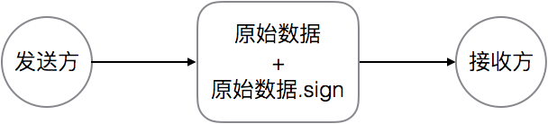
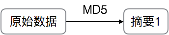
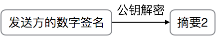
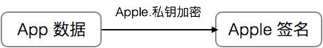
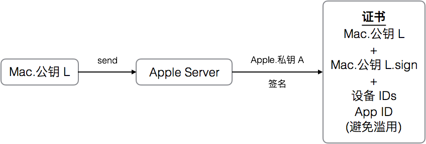
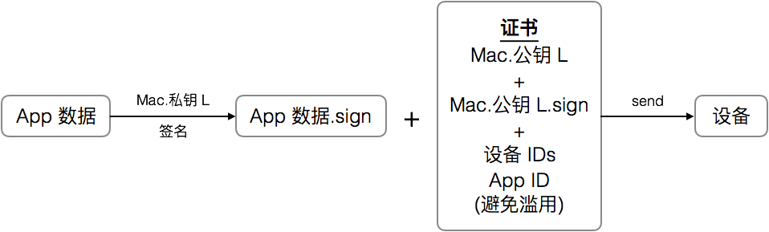
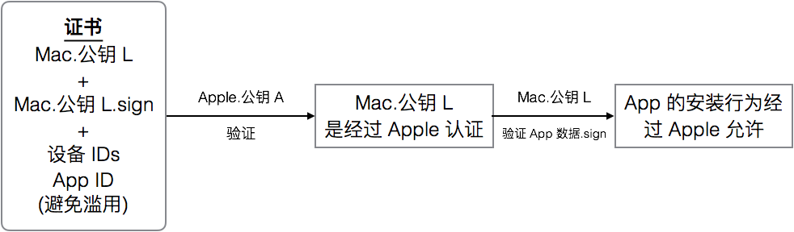
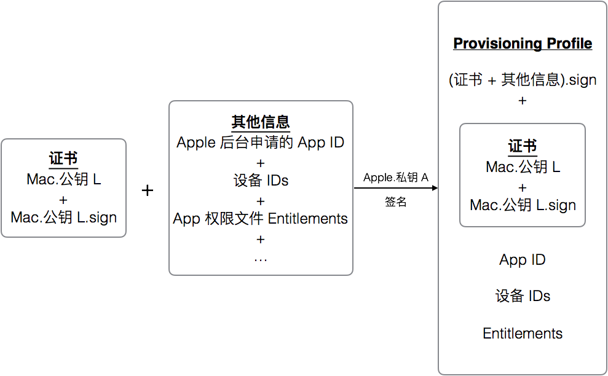
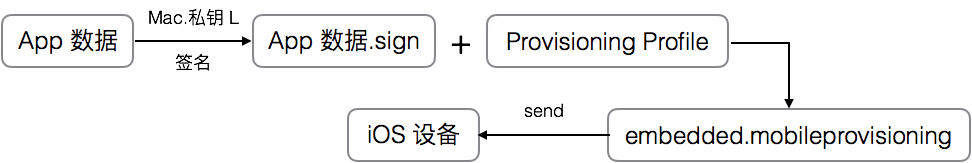
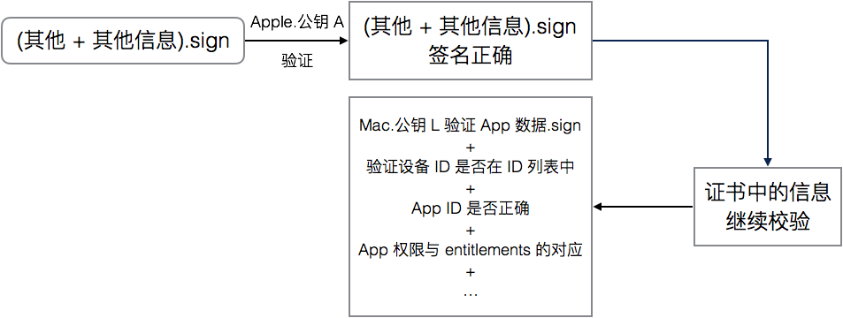

[TOC]

# iOS 签名机制

## 基本概念

### 非对称加密

- 公钥（对外公布）
- 私钥（自己收藏）

### 数字签名

#### 发送方

- 对一份数据进行标记，表明改数据被发送方认可，接收方通过验证该签名，确保数据没有被篡改
- 发送过程
	
	
	
	


#### 接收方

- 对原始数据生成摘要
	
	
	---
	
- 对数字签名进行解密
	
	
	---

- 最后，判断 摘要1 与 摘要2 是否相等，若想等，则数据没有被篡改过


## Level 1 签名

### 相关东西

Apple

- 公钥：已经存放在 iOS 设备中
- 私钥：存放在 Apple 后台

---

### App 上传到 App Store 后



---

### iOS 下载 App


--- 

## Level 2 签名（开发时安装 App）

### 相关东西

Mac

- 公钥 L
- 私钥 L

Apple

- 公钥 A：iOS 设备
- 私钥 A：后台

```swift
struct Mac {
	公钥 L
	私钥 L
}

struct Apple {
	公钥 A
	私钥 A
}
```

---


### 生成证书



---


### 开发时将 App 传送到设备




**需要记住的是：这里的 Mac.公钥 L.sign 是使用 Apple.私钥 A 加密的**

---

### 开发时安装



**需要记住的是：这里的 App 有关数据之前是被 Mac.私钥 L 加密过的**

---

## Level 3 Provisioning profile 的加入

Provisioning profile 用来装载 设备 ID，App ID，权限开关 Entitlements 等信息

### 相关东西

Mac

- 公钥 L
- 私钥 L

Apple

- 公钥 A：iOS 设备
- 私钥 A：后台

```swift
struct Mac {
	公钥 L
	私钥 L
}

struct Apple {
	公钥 A
	私钥 A
}
```

---

### 生成证书 && 生成 Provisioning Profile



---

### 开发时将 App 传送到设备



**App 数据.sign + Provisioning Profile 一同放进 App 中，名为 embeded.mobileprovisioning**

---

### 开发时安装



---

## 其他

Keychain -> 从证书颁发机构请求证书 -> 生成：

- 公钥：CertificateSigningRequest
- 私钥：保存在本地

CertificateSigningRequest --- send ---> Apple Server --- download ---> 证书

其他 Mac 需要编译签名同一个 App ？ ---> Keychain 将私钥导出 ---> .p12 文件

Mach-O 可执行文件把签名写进 embeded.mobileprovision 文件，其他资源文件保存在 _CodeSignature 目录下

##### [学习链接](http://blog.cnbang.net/tech/3386/)

